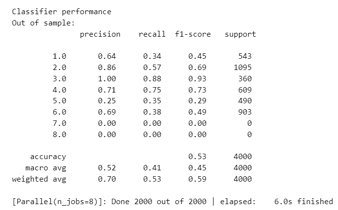
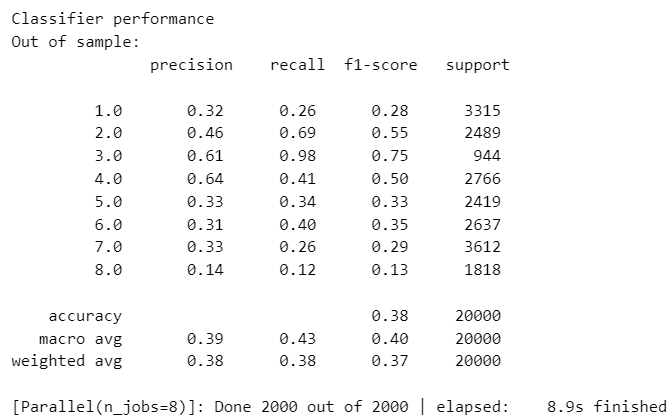

# SHL_2024
kobu SHL_2024のセンサデータについての実戦学習  
v3ではランダム訓練データとvalidationデータをテストデータとして行った。ランダム推測よりはできていた。（ただvalidation_dataの使い方がわかっていないかもしれない)  
v4では訓練データの170000~190000を使って訓練データとテストデータを作成し学習を行った。こうするとv3よりも性能はよくなったが理由は分からない。謎  
v3とv4の違いは同じデータセット内から訓練データとテストデータを分割したかどうか、あと訓練データとテストデータの比率。  
なぜ訓練データとテストデータの用意する方法を変えたのかというと、生データの先頭2万行とか中央2万行とかを抽出するとクラスがかなり偏るからである。できるだけ訓練データ全体からランダムサンプリングをしたかったからv3ではそれを行った。  

### v4での学習１
v4ではtrain_170000to190000データを使って訓練データとテストデータをシャッフルなしで分割。学習データのみ後でシャッフルして学習し、評価。この場合がもっとも性能が高い。  
  
### v4での学習２  
そのあとv4で訓練データtrain_random_range0to170000とテストデータtrain_170000to190000を使って学習、評価その結果が以下  
  
このデータセットの場合20000データではデータ数が少なすぎて過学習を起こしているのかもしれない。  
学習１と２で変化しているのは、なぜだろう